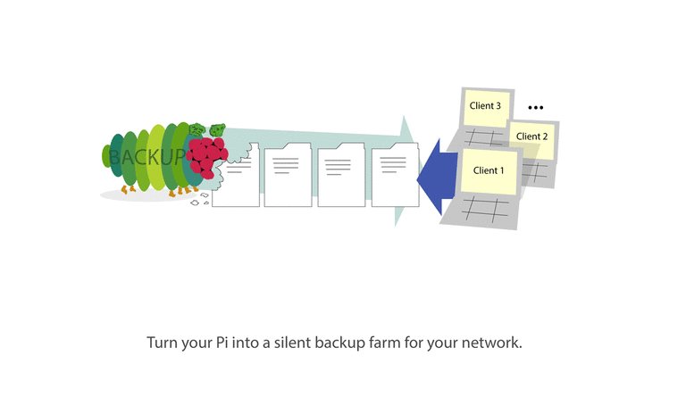

# Very Hungry Pi



## News

### Version 2 (beta) released.

I'm happy to announce Version 2 (beta) of *vhpi*.
It's an entire rewrite. There is a `vhpi` package now on [pypi](https://pypi.python.org/pypi/vhpi) and a simple command line interface to run *vhpi* more conveniently. There are some minor breaking Changes in the config. The most important thing to notice, if you upgrade from v1 to v2, is that the snapshot directories have a new naming convention. `monthly.1` would now be `2017-10-11__02:07:03__monthly.1`. The timestamp tells you when the backup was finished. If you want to use your current snapshots with v2, you should adjust their names accordingly. See [CHANGELOG.md](https://github.com/feluxe/very_hungry_pi/blob/2.0/CHANGELOG.md) for more changes.

## Contents
* [Description](#description)
* [Features](#features)
* [Requirements](#requirements)
* [Example Config](#example_config)
* [Installation & Configuration](#install)

## <a name="description"></a> Description
With **vhpi** you can turn your Raspberry Pi into a silent backup module for your Network.
*Vhpi* creates [incremental](https://en.wikipedia.org/wiki/Incremental_backup) [snapshot](https://github.com/feluxe/very_hungry_pi/wiki/Snapshots-explanation) backups of available network shares (e.g. [NFS](https://en.wikipedia.org/wiki/Network_File_System), [Samba](https://en.wikipedia.org/wiki/Samba_(software))) silently and automated with a minimum of disk space required.
*Vhpi* runs entirely on 'server-side'; clients only need to share/export backup sources with the Pi and let the Pi run the backups in the background. 
*Vhpi* uses battle proven tools like [rsync](https://en.wikipedia.org/wiki/Rsync) to create the backups and [cp](https://en.wikipedia.org/wiki/Cp_(Unix)) to create hardlinks for the snapshots. 
To get the most control over the backups *vhpi* takes raw [rsync options](http://linux.die.net/man/1/rsync) for configuration.
*Vhpi* writes two log files: one for a short overview of the entire process ([info.log exmpl.](vhpi/examples/info.log)) and one for debugging ([debug.log exmpl.](vhpi/examples/debug.log)).


**TL;DR:** Just setup *vhpi*, run your Pi 24/7 and don't care about backups no more.
<br>

## <a name="features"></a> Features

* *Vhpi* works with any rsync command you like. This gives you a wide and well documented variety of configuration options for your backup.
* You can create multiple *exclude-lists* to exclude files/dirs from the backup. (See 'exclude_lib' in [Example Config](#example_config))
* *Vhpi* creates [snapshots](https://github.com/feluxe/very_hungry_pi/wiki/Snapshots-explanation) for any time-interval you like. (e.g. 'hourly', 'daily', 'weekly', 'monthly', 'each-4-hours', 'half-yearly', etc...) Just add the interval name and its duration in seconds to the config. (See 'intervals' in [Example Config](#example_config)).
* You can set the amount of snapshots that you want keep for each used interval.
    E.g. if you want to keep 3 snapshots for the 'hourly' interval you get three snapshot dirs: `hourly.0`, `hourly.1`, `hourly.2`. Each snapshot reaches an hour further into the past.
* Snapshots require a minimum of disk space:
    * because the backups are created incrementally. 
    * because *vhpi* creates new snapshots as 'hard links' for all files that haven't changed. (No duplicate files.. just links)
* The process is nicely logged ('info.log', 'debug.log').
* If a backup process takes long, *vhpi* blocks any attempt to start a new backup process until the first one has finished to prevent the Pi from overloading.
* More features are planned (See: [Version Overview](https://github.com/feluxe/very_hungry_pi/wiki/Version-Overview-(TODOs)))

## <a name="requirements"></a> Requirements:

* You need Python >= 3.6 on your Pi for *vhpi* to run. ([How to install Python3.x on your Pi](https://github.com/feluxe/very_hungry_pi/wiki/Install-Python3.X-from-source-on-a-Raspberry-Pi-(Raspbian)))
* The file system of your Backup destination has to support hard links. (most common fs like NTFS and ext do...)

## <a name="install"></a> Installation & Configuration


### Sharing sources with the Pi:

Your Pi needs access to the directories of each client that you want to backup. Just share/export them with `NFS` or `Samba`. Perhaps *vhpi* can create local backups as well.

You should use `autofs` or similar to automatically mount the shared directories with your Pi whenever they are available. This way your Pi will automatically mount the directories whenever a machine enters the network.

There is a tutorial on this in the wiki: [How to share sources with your Raspberry Pi using NFS.](https://github.com/feluxe/very_hungry_pi/wiki/How-to-share-sources-with-your-Raspberry-Pi-using-NFS.)


### Download and Install:

Simplest way to install *vhpi* is by useing pip. You need Python3.6 for *vhpi* to run. ([How to install Python3.x on your Pi](https://github.com/feluxe/very_hungry_pi/wiki/Install-Python3.X-from-source-on-a-Raspberry-Pi-(Raspbian)))
After you installed Python3.6 you can run pip to install *vhpi* like this:
```
$ pip3.6 install vhpi
```

Run this command to check if *vhpi* was isntalled successfully:

```
$ vhpi --help
```
It should print the help text to the terminal.


### Configure vhpi:

When you run *vhpi* for the first time, it creates a config dir at `~/.config/vhpi/`, you'll find a file called `vhpi_cfg.yaml` there. This is where you configure your backups. The config file is pretty self explanatory, just have a look at the [Example Config](#example_config)


### Test the configuration 

In order to test *vhpi* I suggest setting up some dummy backup sources that point to some safe destinations. Maybe in the `/tmp` dir or so. Then run the following command a couple of times and see if the destination gets filled with backups/snapshots:

 ```
 $ vhpi run
 ```
 
If you get an error try to adjust the config. If you think there is a bug feel free to use the [github issue tracker](https://github.com/feluxe/very_hungry_pi/issues)!
The results of each run is written to the log-files as well (`~/.config/vhpi/debug.log` and `~/.config/vhpi/info.log`)

### <a name="create_cronjob"></a> Create a Cronjob

You can run *vhpi* manually with this command `vhpi run`, but I suggest creating a cronjob that runs *vhpi* automatically every hour. To do so you can add the following line to `/etc/crontab`. (Replace `username` with the username that is supposed to run *vhpi*.)

```
@hourly         username   vhpi run
```

If want to set the cronjob to something else than *hourly*, you might want to read this: [Choosing an interval for the cornjob.](https://github.com/feluxe/very_hungry_pi/wiki/Choosing-an-interval-for-the-cronjob.)

You can also add multiple cronjobs that execute *vhpi* in different intervals for different users.

After you added the cronjob, you should restart your Pi or restart the crontab like this:

```
$ /etc/init.d/cron restart
```

If this is all done, your Pi should run *vhpi* every hour and you should see some activity in the log files and of cause on your hard drive. Yay! :D


## <a name="example_config"></a> Example Config

#### `~/.config/vhpi/vhpi_cfg.yaml`

 ```yaml  
# IMPORTANT: If you use paths that contain spaces, make sure to escape them 
# with \ (backslash). The same counts for escape items.

# Basic App Settings:
app_cfg:
  # Create different list of files/dirs that you want to exclude from your
  # backups.
  exclude_lib:
    standard_list: [
      lost+found/*,
      .cache/chromium/*,
      .mozilla/firefox/*/Cache,
      .cache/thumbnails/*,
      .local/share/Trash/*
    ]
    another_list: [
      some_dir
    ]
  # Define time intervals, which you may use for your snapshots.
  # Feel free to use your own definitions like 'every_four_hours: 14400' etc.
  # Values must be in Seconds.
  intervals: {
    hourly: 3600,
    six-hourly: 21600,
    daily: 86400,
    weekly: 604800,
    monthly: 2592000,
    yearly: 31536000
  }

# Backup Jobs Config.
# Configure each backup source here:
jobs:
  # Source 1:
  - name: 'Dummy Source'
    source_ip: '192.168.178.20'             # The ip of the computer to which the mounted src dir belongs to. If it's a local source use: "127.0.0.1" or "localhost".
    rsync_src: '/tmp/tests/dummy_src/src1/'      # The path to the mounted or local dir.
    rsync_dst: '/tmp/tests/dummy_dest/dest1/'    # The path to the destination dir in which each snapshot is created.
    rsync_options: '-aAHSvX --delete'       # The options that you want to use for your rsync backup. Default is "-av". More info on rsync: http://linux.die.net/man/1/rsync
    exclude_lists: [                        # Add exclude lists to exclude a list of file/folders. See above: app_cfg -> exclude_lib
      standard_list,
      another_list
    ]
    excludes: [                             # Add additional source specific exclude files/dirs that are not covered by the exclude lists.
      downloads,
      tmp
    ]
    snapshots:                              # Define how many snapshots you want to keep for each interval. Older snapshots are deleted automatically.
      hourly: 6
      six-hourly: 4
      daily: 7
      weekly: 4
      monthly: 6
      yearly: 6

  # Source 2:
  # - name: 'Another Dummy Source'
  #  source_ip: 192.168.178.36
  # etc...'
 ```
 
