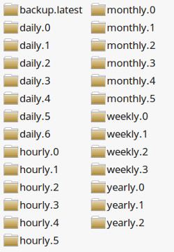

# Very Hungry Pi


## Overview
With `vhpi` you can turn your Raspberry Pi into a silent backup farm for your LAN.
Vhpi creates [incremental](https://en.wikipedia.org/wiki/Incremental_backup) [snapshot](#snapshots) backups of available network shares (e.g. NFS, Samba) silently and automated with a minimum of disk space required.
To get the most control over the backups vhpi takes raw rsync options for configuration.
Vhpi writes two log files; one for debugging (debug.log) and one for a short overview of the entire progress (info.log).
<br><br>Setup vhpi, let your Pi run 24/7 and don't care about backups no more.
<br>
<br>
**All you have to do is this:**

* create a NFS or Samba share for any directory of any computer in your LAN that you want to backup. (Of cause vhpi lets you create backups of your Pi's local files too)
* use `autofs` or similar to automatically mount the shared directories with your Pi.
* install and configure vhpi (see: [Installation & Configuration](#installation_&_setup))
* add a cronjob to run vhpi automatically. (see: [Create a cronjob](#create_cronjob))
* Done. Now your Pi will automatically create new snapshots if a source computer is online and a snapshot is due.


## <a name="installation_&_setup"></a> Installation & Configuration

#### Get vhpi:

Either download the [zip from github](https://github.com/feluxe/very_hungry_pi/archive/master.zip) and unzip it to `/opt/very_hungry_pi`<br>
Or clone the repository to `/opt/very_hungry_pi`.

```
$ cd /opt
$ sudo git clone https://github.com/feluxe/very_hungry_pi.git
```
        
#### Copy config files into user's home.

vhpi will look in `~/.very_hungry_pi/` for config files. Just copy them from /opt/very_hungry_pi/data/* to ~/.very_hungry_pi

```
$ mkdir ~/.very_hungry_pi
$ cp -r /opt/very_hungry_pi/data/* ~/.very_hungry_pi/
```

#### Configure vhpi:

Just have a look at the [example config](#example_config), it is self explanatory.<br>
The path to the config file must be this one: `~/.very_hungry_pi/config.yaml`


#### Create validation files

Before vhpi starts a backup it validates if the source is readable and all good to go.
In order to do that it looks for a validation file in each source.
The validation file must be created manually, to prevent misconfiguration.<br>
<br>
Create an empty hidden file named '.backup_valid' in each source directory. E.g.:

```
$ touch /path/to/src1/.backup_valid
```

#### Test the configuration

If you run vhpi for the first time you should use the `--dry-run` flag for rsync.  That way the backup is just simulated:

```
-n, --dry-run               perform a trial run with no changes made
```

 A good command to test the config would be `-avn --delete`
 You should just use it for each backup source in the [config](#example_config) for `rsync_options` when you run vhpi for the first time.
 
 More on rsync options can be found here: http://linux.die.net/man/1/rsync
 
 Now you can test and run vhpi manually with this command:
 ```
 $ python3 /opt/very_hungry_pi/vhpi.py
 ```
 The error messages should give you some detail about what still needs to be done, if so.<br>
 If the configuration works like expected you should create a cronjob. (see the next step.)
 

#### <a name="create_cronjob"></a> Create a cronjob

Vhpi should be started in a time interval that is at least as small as the smallest used snapshot interval. If you want to create hourly snapshot the cronjob should start at least every hour.
The more often vhpi is started the greater is the chance that it catches the source computers running. For example if you use a cronjob that starts evert 24 hours chances may be high that vhpi won't catch the source computer for many days.
So even if your smallest snapshot is on a daily bases, you should consider running the cronjob each hour.

Add the following line to `/etc/crontab`
```
@hourly         username   python3 /opt/very_hungry_pi/vhpi.py
```

For username use the user that should start the script, which would be the one that has permission to the source files.
If you want to backup files for multiple users, add a cronjob for each user.

Restart crontab:

```
$ /etc/init.d/cron restart
```

Now vhpi should start every hour and you should see some activity in the log files and of cause on your hard drive.

## Features

* vhpi uses [`rsync`](http://linux.die.net/man/1/rsync) to make the incremental backups. It should work with any rsync command you like.
* You can create multiple `exclude lists` to exclude files/folders from the backup. (TODO: write howto for exclude list
* vhpi creates [snapshots](#snapshots) for any time-interval you want. (e.g. 'hourly', 'daily', 'weekly', 'monthly', 'each-4-hours', 'half-yearly', etc...) Just add the interval name and its duration in seconds to the [config](#example_config)) under `app_cfg -> intervals`.
* You can `set the amount of snapshots to keep for each used interval`.
    E.g. if you want to keep 3 snapshots for 'hourly' you get three snapshot dirs like that: 'hourly.0', 'hourly.1', 'hourly.2'. Each snapshot reaches an hour further into the past.
* Snapshots require `a minimum of disk space`:
    * 1) because rsync only copies files into the backup that are new or changed. 
    * 2) because vhpi creates new snapshots using 'hard links' for all files that haven't changed.
    * 3) All Snapshots are searched for duplicate files (independent of their names) every X amount of time. Duplicates are deleted and replaced with hardlinks. (This feature is not yet implemented)
* The progress is nicely logged to the log-files ('info.log', 'debug.log').


    

## <a name="snapshots"></a> Snapshots

A snapshot represents the state in which the source directory was, at a certain point in time. For each new snapshot only new and changed files are added; files that haven't changed are created as `hard links` to keep the backup slim.
The following example grafik shows the result of a backup with the following snapshot configuration, that was run several years (see all the yearly dirs were created):

**snapshot config example**
```yaml
...
rsync_src: sample/src/dir
rsync_dest: sample/dest/dir
...
snapshots:
  hourly: 6     # Keeps a snapshot each hour for the last 6 hours 
  daily: 7      # Keeps a snapshot each day for the last 7 days.
  weekly: 4     # etc..
  monthly: 6
  yearly: 3
...
```

**sample/dest/dir**
<br>



## What the script does in detail

Each time vhpi.py is executed by the cronjob, this is what happens:

* First vhpi makes sure there is no older instance of vhpi running. This is the case when an older backup takes longer than the cronjob interval. (['fcntl.flock'](https://docs.python.org/3.4/library/fcntl.html#fcntl.flock) is used to block the script)
* For each backup source that is defined in the config file vhpi uses the following routine:
    * It checks if any snapshot (e.g. hourly, daily, weekly, ..) is due. It uses a hidden time-stamp file for that, which is located in the dest dir. 
    * If there are due jobs vhpi sends a ping to checks if the source machine online and available.
    * It checks if the source directory is readable by reading the 'validation file' which must be located in the backup source dir. 
    * It checks if the destination directory is valid using 'os.path.exists'.
    * It runs the incremental backup using rsync with the options that are defined in the config file. The destination of the rsync backup is the 'backup.latest' dir.
    * It deletes old/deprecated snapshots. (every snapshot dir that has a number on it which is greater than the amount you want to keep is deleted.)
    * It shifts the snapshots by renaming their directories (hourly.0 -> hourly.1, hourly.1 -> hourly.2, monthly.0 -> monthly.1, etc..)
    * It creates 'hard links' from 'backup.latest' to each new snapshot dir.
    * It updates the timestamp for each successful snapshot
    * Done.


## <a name="example_config"></a> Example Config 

 ```yaml  
# Basic App config:
app_cfg:
  # Add default lists for exclude files under exclude_lib.
  # You can use exclude lists for a job if you  add them under jobs_cfg -> exclude_list
  exclude_lib:
    standard_list: [
      lost+found/*,
      .cache/chromium/*,
      .mozilla/firefox/*/Cache,
      .cache/thumbnails/*,
      .local/share/Trash/*
    ]
    another_list: [
      some_dir
    ]
  # Here you can define time intervals, which you may use for your snapshots.
  # Define any interval you want e.g. 'hourly: 3600'
  # Feel free to use your own definitions like 'every_four_hours: 14400' etc.
  # Values must be in Seconds.
  intervals: {
    hourly: 3600,
    six-hourly: 21600,
    daily: 86400,
    weekly: 604800,
    monthly: 2592000,
    yearly: 31536000
  }

# Add configuration for each backup source here.
jobs_cfg:

  # Source 1:
  - source_ip: '192.168.178.20'             # The ip of the computer to which the mounted src dir belongs to. If it's a local source use: "127.0.0.1"
    rsync_src: tests/dummy_src/src1/        # The path to the mounted or local dir.
    rsync_dest: tests/dummy_dest/dest1/     # The path to the destination dir in which the snapshots are created.
    rsync_options: '-aAHSvX --delete'       # The options that you want to use for your rsync backup. Default is "-av". More info on rsync: http://linux.die.net/man/1/rsync
    exclude_lists: [                        # Add exclude lists to exclude a list of file/folders. See above: app_cfg -> exclude_lib 
      standard_list,
      another_list
    ]
    excludes: [                             # Add additional source specific exclude files/dirs that are not covered by the exclude lists.
      downloads,
      tmp
    ]
    snapshots:                              # Define how many snapshots you want to keep of each interval that you wish to use. Older snapshots are deleted automatically.
      hourly: 0
      six-hourly: 0
      daily: 7
      weekly: 4
      monthly: 6
      yearly: 6
      
  # Source 2:
  - source_ip: 192.168.178.36
   # etc...
 ```
 
 
 TMP:
 
 Requirements:
 you need to install rsync
 [Config] Allow user access permission to ping tool
	sudo chmod u+s /bin/ping


