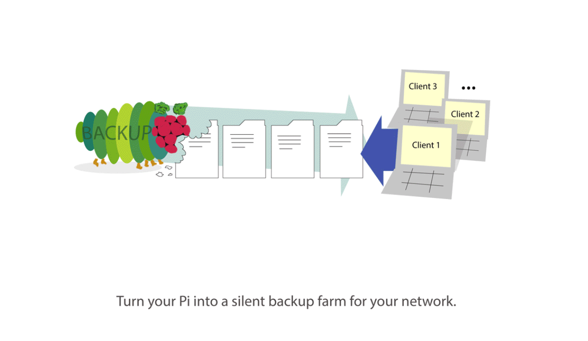

# Very Hungry Pi


## Contents
* [Description](#description)
* [Features](#features)
* [Requirements](#requirements)
* [Example Config](#example_config)
* [Installation & Configuration](#install)

## <a name="description"></a> Description
With **vhpi** you can turn your Raspberry Pi into a silent backup module for your Network.
*Vhpi* creates [incremental](https://en.wikipedia.org/wiki/Incremental_backup) [snapshot](https://github.com/feluxe/very_hungry_pi/wiki/Snapshots-explanation) backups of available network shares (e.g. [NFS](https://en.wikipedia.org/wiki/Network_File_System), [Samba](https://en.wikipedia.org/wiki/Samba_(software))) silently and automated with a minimum of disk space required.
*Vhpi* runs entirely on 'server-side'; clients only need to share/export backup sources with the Pi and let the Pi run the backups in the background. 
*Vhpi* uses battle proven tools like [rsync](https://en.wikipedia.org/wiki/Rsync) to create the backups and [cp](https://en.wikipedia.org/wiki/Cp_(Unix)) to create hardlinks for the snapshots. 
To get the most control over the backups *vhpi* takes raw [rsync options](http://linux.die.net/man/1/rsync) for configuration.
*Vhpi* writes two log files: one for a short overview of the entire process ([info.log exmpl.](examples/log/info.log)) and one for debugging ([debug.log exmpl.](examples/log/debug.log)).

More details about the script in the wiki: ['What the script does in detail'](https://github.com/feluxe/very_hungry_pi/wiki/What-the-script-does-in-detail).

**TL;DR:** Just setup vhpi, run your Pi 24/7 and don't care about backups no more.
<br>

## <a name="features"></a> Features

* *Vhpi* works with any rsync command you like. This gives you a wide and well documented variety of configuration options for your backup.
* You can create multiple *exclude-lists* to exclude files/dirs from the backup. (See 'exclude_lib' in [Example Config](#example_config))
* *Vhpi* creates [snapshots](https://github.com/feluxe/very_hungry_pi/wiki/Snapshots-explanation) for any time-interval you like. (e.g. 'hourly', 'daily', 'weekly', 'monthly', 'each-4-hours', 'half-yearly', etc...) Just add the interval name and its duration in seconds to the config. (See 'intervals' in [Example Config](#example_config)).
* You can set the amount of snapshots that you want keep for each used interval.
    E.g. if you want to keep 3 snapshots for the 'hourly' interval you get three snapshot dirs: `hourly.0`, `hourly.1`, `hourly.2`. Each snapshot reaches an hour further into the past.
* Snapshots require a minimum of disk space:
    * because the backups are created incrementally. 
    * because *vhpi* creates new snapshots as 'hard links' for all files that haven't changed. (No duplicate files.. just links)
* The process is nicely logged ('info.log', 'debug.log').
* If a backup process takes a long time, *vhpi* blocks any attempt to start a new backup process until the first one has finished to prevent the Pi from overloading.
* More features are planned (See: [Version Overvire](https://github.com/feluxe/very_hungry_pi/wiki/Version-Overview-(TODOs)))

##<a name="requirements"></a> Requirements:

* You need Python >= 3.4 on your Pi for *vhpi* to run.
* The file system of your Backup destination has to support hard links. (most common fs like NTFS and ext do...)

## <a name="example_config"></a> Example Config 

 ```yaml  
# Basic App Settings
########################################################################

app_cfg:
  # Add default lists for exclude files under exclude_lib.
  # You can use exclude lists for a job if you  add them under jobs_cfg -> exclude_list
  exclude_lib:
    standard_list: [
      lost+found/*,
      .cache/chromium/*,
      .mozilla/firefox/*/Cache,
      .cache/thumbnails/*,
      .local/share/Trash/*
    ]
    another_list: [
      some_dir
    ]
  # Here you can define time intervals, which you may use for your snapshots.
  # Define any interval you want e.g. 'hourly: 3600'
  # Feel free to use your own definitions like 'every_four_hours: 14400' etc.
  # Values must be in Seconds.
  intervals: {
    hourly: 3600,
    six-hourly: 21600,
    daily: 86400,
    weekly: 604800,
    monthly: 2592000,
    yearly: 31536000
  }

# Backup Jobs
# Configure each backup source here.
########################################################################

jobs_cfg:

  # Source 1:
  - source_ip: '192.168.178.20'             # The ip of the computer to which the mounted src dir belongs to. If it's a local source use: "127.0.0.1"
    rsync_src: tests/dummy_src/src1/        # The path to the mounted or local dir.
    rsync_dest: tests/dummy_dest/dest1/     # The path to the destination dir in which the snapshots are created.
    rsync_options: '-aAHSvX --delete'       # The options that you want to use for your rsync backup. Default is "-av". More info on rsync: http://linux.die.net/man/1/rsync
    exclude_lists: [                        # Add exclude lists to exclude a list of file/folders. See above: app_cfg -> exclude_lib 
      standard_list,
      another_list
    ]
    excludes: [                             # Add additional source specific exclude files/dirs that are not covered by the exclude lists.
      downloads,
      tmp
    ]
    snapshots:                              # Define how many snapshots you want to keep of each interval that you wish to use. Older snapshots are deleted automatically.
      hourly: 0
      six-hourly: 0
      daily: 7
      weekly: 4
      monthly: 6
      yearly: 6
      
  # Source 2:
  - source_ip: 192.168.178.36
   # etc.. reapt stuff from 'Source 1'
   
 ```
 
## <a name="install"></a> Installation & Configuration


### Share backup sources with the Pi:

Your Pi needs access to the directories of each client that you want to backup. Just share/export them with `NFS` or `Samba` (There are plenty tutorials online for this common task).
Perhaps vhpi can also create backups of your Pi's local directories too.

You should use `autofs` or similar to automatically mount the shared directories with your Pi when ever they are available. This way you don't have to manually share them each time your Pi or a client reboots.

### Get vhpi:

I haven't had the time to create a .deb package for an automated setup, so for now you need to setup the script manually. Just follow the steps below.


Either download the [zip from github](https://github.com/feluxe/very_hungry_pi/archive/master.zip) and unzip it to `/opt/very_hungry_pi`<br>
Or clone the repository to `/opt/very_hungry_pi`.

```
$ cd /opt
$ sudo git clone https://github.com/feluxe/very_hungry_pi.git
```
        
### Copy config files into user's home.

vhpi will look in `~/.very_hungry_pi/` for config files. Just copy them from /opt/very_hungry_pi/examples/config* to ~/.very_hungry_pi

```
$ mkdir ~/.very_hungry_pi
$ cp -r /opt/very_hungry_pi/examples/config/* ~/.very_hungry_pi/
```

In case you want to run vhpi as `root`, you have to put the config in `/root/.very_hungry_pi`

### Configure vhpi:

Just have a look at the [example config](#example_config), it is self explanatory.<br>
The path to the config file must be this one: `~/.very_hungry_pi/config.yaml` (Like described in the step above..)


### Create validation files

Before vhpi starts a backup it validates if the source directory is readable and all good to go.
In order to do so it looks for a hidden validation file in each source.
You must create the validation file manually.<br>
<br>
Create an empty file named '.backup_valid' in the directory that you want to backup E.g.:

```
$ touch /path/to/src1/.backup_valid
```


### Test the configuration 

If you are not already familiar with **rsync**, have a little advice on how to configure a first test-run.
If you run vhpi for the first time you should use the rsync `--dry-run` flag.  That way the backup is just simulated. This is from the rsync manual:

```
-n, --dry-run               perform a trial run with no changes made
```

So a good command to test the config would be `rsync -avn --delete`
`-a` = archive mode. This is the standard backup mode for rsync. 
`-v` = verbose mode. This option increases the amount of log information rsync gives you during execution.
`-n` = dry-run. See above.
`--delete` = This option deletes all files that are found in the backup but not in the source. This is very important. If you don't add it your snapshots will be flooded with deprecated and duplicated files. I would always use it with vhpi.
 
More on rsync options can be found here: http://linux.die.net/man/1/rsync
 
Now you should be ready to test-run vhpi manually like that:
If you think your configuration is fine and good to go for a test run open your terminal and run vhpi manually like this:
 ```
 $ cd /opt/very_hungry_pi/
 $ python3 -m vhpi.main
 ```
 If you get an error try to adjust the config. If you think there is a bug use the github issue tracker.
 You can find the results of each execution in the log files as well (.very_hungry_pi/debug.log and .very_hungry_pi/info.log)
 If your configuration works like you expected, you should create a cronjob to make your Pi run vhpi automatically. (see the next step.)
 

### <a name="create_cronjob"></a> Create a cronjob

For most convienice your Pi should create its backups automatically. A good way to make that happen is to create a cronjob, which automatically executes vhpi in an interval.

To run vhpi every hour you can just add the following line to `/etc/crontab`. Replace `username` with the username that is supposed to run vhpi. (in most cases that would be `root`)
```
@hourly         username   cd /opt/very_hungry_pi/ && python3 -m vhpi.main
```

You can use any time interval you like for the cronjob, but keep in mind that the time interval should be at least as small as the smallest used snapshot interval. E.g. if you want to create hourly snapshots the cronjob should run vhpi at least every hour, otherwise you won't get a snapshot for each hour.
Another thing to keep in mind: The more frequently your cronjob starts vhpi, the higher is the chance you get a new backup. E.g. if you use a cronjob that only starts every 24 hours the chances are high that you won't get a backup for several days in a row, because your client machines weren't running when the cronjob executed vhpi. So even if your smallest snapshot is supposed to happen daily, you should consider making the cronjob run vhpi each hour or so, that way chances are higher that you get a daily backup.

You can also add multiple cronjobs that execute vhpi in different intervals from different users. Thou, In most cases it would be enough if you just run vhpi hourly by root. 

After you added the cronjob, you should restart your Pi or restart the crontab like this:

```
$ /etc/init.d/cron restart
```

Now vhpi should start every hour and you should see some activity in the log files and of cause on your hard drive. Yay!

For each newly added backup source I suggest throwing an eye on the log files every now and then until you are sure everything runs the way it should.
